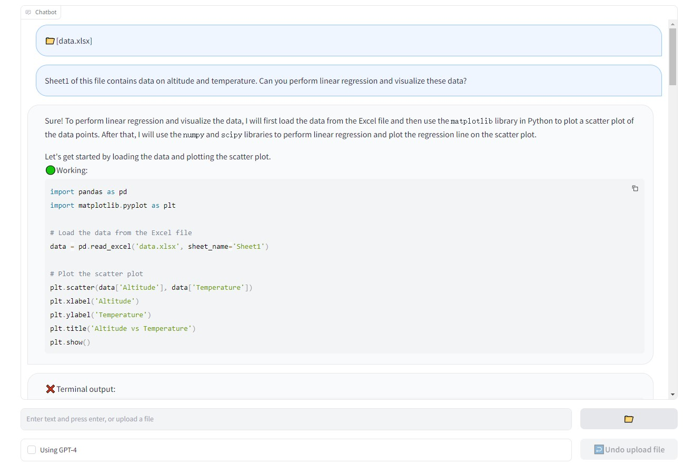

# Local-Code-Interpreter
A local implementation of OpenAI's ChatGPT Code Interpreter.

## Introduction

OpenAI's Code Interpreter plugin for ChatGPT is a revolutionary feature that allows the execution of Python code within the AI model. However, it execute code within an online sandbox and has certain limitations. In this project, we present Local Code Interpreter – which enables code execution on your local device, offering enhanced flexibility, security, and convenience.

## Key Advantages

- **Custom Environment**: Execute code in a customized environment of your choice, ensuring you have the right packages and settings.

- **Seamless Experience**: Say goodbye to file size restrictions and internet issues while uploading. With Local Code Interpreter, you're in full control.

- **GPT-3.5 Availability**: While official Code Interpreter is only available for GPT-4 model, the Local Code Interpreter offers the flexibility to switch between both GPT-3.5 and GPT-4 models.

- **Enhanced Data Security**: Keep your data more secure by running code locally, minimizing data transfer over the internet.

## Note
Executing AI-generated code without human review on your own device is not safe. You are responsible for taking measures to protect the security of your device and data (such as using a virtural machine) before launching this program. All consequences caused by using this program shall be borne by youself.

## Usage

### Getting Started

1. Clone this repository to your local device
   ```shell
   git clone https://github.com/MrGreyfun/Local-Code-Interpreter.git
   ```

2. Install the necessary dependencies. The program has been tested on Windows 10 and CentOS Linux 7.8, with Python 3.9.16. Required packages include:
   ```text
   Jupyter Notebook    6.5.4
   gradio              3.39.0
   openai              0.27.8
   ```
   Other system or package version may also work.
### Configuration

1. Create a `config.json` file in the `src` directory, following the examples provided in the `config_example` directory.

2. Configure your API key in the `config.json` file.

Please Note:
1. **Set the `model_name` Correctly**
    This program relies on the function calling capability of two specific models:
    - `gpt-3.5-turbo-0613`
    - `gpt-4-0613`

    Older versions of the models will not work. 

    For Azure OpenAI service users:
    - Set the `model_name` as your deployment name.
    - Confirm that the deployed model corresponds to the `0613` version.

2. **API Version Settings**
    If you're using Azure OpenAI service, set the `API_VERSION` to `2023-07-01-preview` in the `config.json` file. Note that other API versions do not support the necessary function calls for this program.

3. **Alternate API Key Handling**
    If you prefer not to store your API key in the `config.json` file, you can opt for an alternate approach:
    - Leave the `API_KEY` field in `config.json` as an empty string:
        ```json
        "API_KEY": ""
        ```
    - Set the environment variable `OPENAI_API_KEY` with your API key before running the program:
        - On Windows:
        ```shell
        set OPENAI_API_KEY=<YOUR-API-KEY>
        ```
        - On Linux:
        ```shell
        export OPENAI_API_KEY=<YOUR-API-KEY>
        ```

## Getting Started

1. Navigate to the `src` directory.

2. Run the command:
   ```shell
   python web_ui.py
   ```

3. Access the generated link in your browser to start using the Local Code Interpreter.

## Example

Imagine uploading a data file and requesting the model to perform linear regression and visualize the data. See how Local Code Interpreter provides a seamless experience:

1. Upload the data and request linear regression:
   

2. Encounter an error in the generated code:
   

3. ChatGPT automatically checks the data structure and fixes the bug:
   

4. The corrected code runs successfully:
   

5. The final result meets your requirements:
   
   


