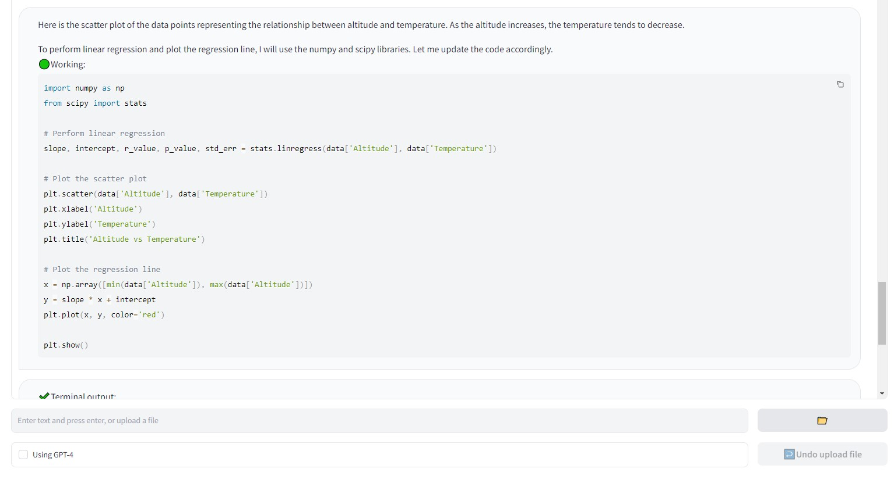

**Read this in other languages: [English](README.md), [中文](README_CN.md).**

# 本地版代码解释器
OpenAI的ChatGPT代码解释器（Code Interpreter或Advanced Data Analysis）的本地版。

## 简介

OpenAI的ChatGPT代码解释器（Code Interpreter，现更名为Advanced Data Analysis）是数据分析的利器。但是，它在是在一个在线沙箱环境中运行代码，因而有诸多限制（缺包、上传慢、只能传100MB以下的文件、代码只运行120秒等）。为此，我们推出了本地版代码解释器（Local Code Interpreter），它您的本地设备上运行代码，解除各种限制，一切尽在掌控之中。

## 优势

- **自定义环境**：在您本地环境中运行代码，确保各种依赖都已正确安装。

- **无缝体验**：告别100MB文件大小限制和网速问题。使用本地版代码解释器，一切尽在掌控之中。

- **可用GPT-3.5**：官方代码解释器只能在GPT-4中使用，但现在你甚至可以在一轮对话中自由切换GPT-3.5和GPT-4。

- **数据更安全**：本地运行代码，文件无需上传，数据更加安全。

## 注意事项
在您自己的设备上执行未经人工审核AI生成的代码是不安全的。在启动此程序之前，您有必要采取措施（例如使用虚拟机）保护您的设备和数据的安全。使用此程序造成的所有后果应由您自己承担。

## 使用方法

### 安装

1. 克隆本仓库
   ```shell
   git clone https://github.com/MrGreyfun/Local-Code-Interpreter.git
   cd Local-Code-Interpreter
   ```

2. 安装依赖。该程序已在Windows 10和CentOS Linux 7.8上测试，使用Python 3.9.16。所需的包和版本：
   ```text
   Jupyter Notebook    6.5.4
   gradio              3.39.0
   openai              0.27.8
   ```
   其他系统或软件包版本也可能有效。
   您可以使用以下命令直接安装所需的软件包：
   ```shell
   pip install -r requirements.txt
   ```
   如果您不熟悉Python，可以使用以下命令安装，它将额外安装常用的Python数据分析库：
   ```shell
   pip install -r requirements_full.txt
   ```
### 配置

1. 在`src`目录中创建一个`config.json`文件，参照`config_example`目录中提供的示例进行配置。

2. 在`config.json`文件中配置您的API密钥。

请注意：
1. **正确设置`model_name`**
    该程序依赖于模型的函数调用能力，目前只有以下两个版本模型能进行函数调用：
    - `gpt-3.5-turbo-0613`
    - `gpt-4-0613`

    旧版本的模型将无法使用。

    对于使用Azure OpenAI的用户：
    - 请将`model_name`设置为您的模型部署名称（deployment name）。
    - 确认部署的模型是`0613`版本。

2. **API版本设置**
    如果您使用Azure OpenAI服务，请在`config.json`文件中将`API_VERSION`设置为`2023-07-01-preview`，其他API版本不支持函数调用。

3. **使用环境变量配置密钥**
    如果您不希望将API密钥存储在`config.json`文件中，可以选择设置环境变量：
    - 将`config.json`文件中的`API_KEY`设为空字符串：
        ```json
        "API_KEY": ""
        ```
    - 在运行程序之前，使用您的API密钥设置环境变量`OPENAI_API_KEY`：
        - Windows：
        ```shell
        set OPENAI_API_KEY=<YOUR-API-KEY>
        ```
        - Linux：
        ```shell
        export OPENAI_API_KEY=<YOUR-API-KEY>
        ```

## 使用

1. 进入`src`目录。
   ```shell
   cd src
   ```

2. 运行以下命令：
   ```shell
   python web_ui.py
   ```

3. 在浏览器中访问终端生成的链接，开始使用本地版代码解释器。

## 示例

以下是一个使用本程序进行线性回归任务的示例：

1. 上传数据文件并要求模型对数据进行线性回归：
   

2. 在生成的代码中遇到错误：
   

3. ChatGPT自动检查数据格式并修复bug：
   

4. 修复bug后的代码成功运行：
   

5. 最终结果符合要求：
   
   
